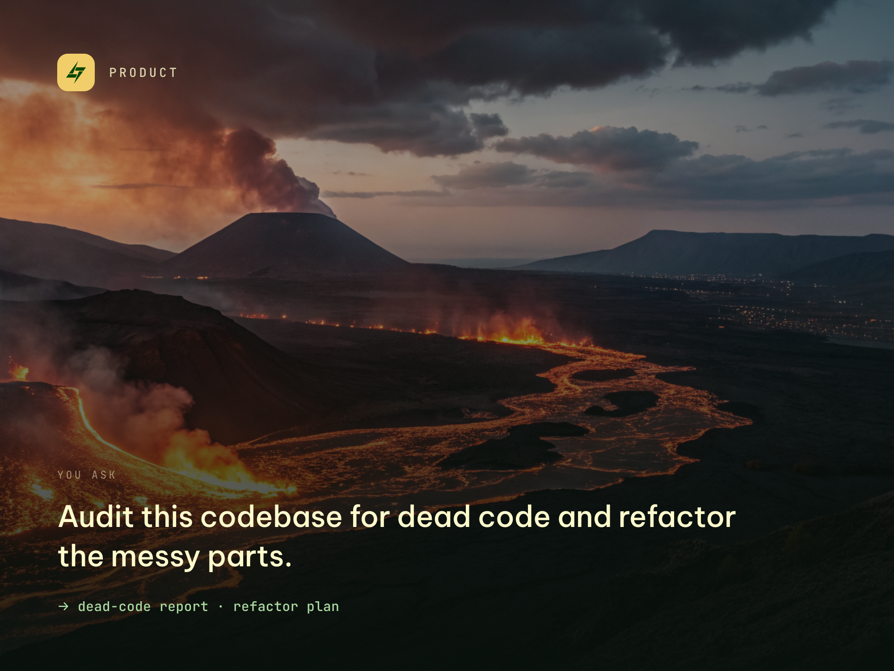

# FORSVN


**Turn your coding agent into a full product team — 49 composable skills across research, marketing, product, and process, from one install.**

Call any skill by verb (`/research-icp`, `/write-copy`, `/architect-system`, `/review-work`) or let the front door route for you (`/forsvn`). Skills chain — each one reads what earlier skills left behind, so output compounds the more you use the stack.



## Install

Pick the path that matches what you want.

### Full experience — skills + the collaborative review UX

Installs **`forsvn`** (the skills) *and* **`forsvn-preview`** (preview any draft as a themed, on-brand page and approve / deny / request changes — the agent drafts, you decide).

```bash
npx plugins add hungv47/meta-skills
```

Claude Code:

```
/plugin marketplace add hungv47/meta-skills
/plugin install forsvn
/plugin install forsvn-preview
```

### Skills only — no preview UI

Just the 49 skills, plain Markdown output, no review surface. Works in Cursor, Codex, Windsurf, Gemini CLI, and VS Code.

```bash
npx skills add hungv47/meta-skills
```

### Useful flags (both CLIs)

```bash
npx skills add hungv47/meta-skills -g                   # install globally
npx skills add hungv47/meta-skills --skill write-copy   # cherry-pick one
npx skills add hungv47/meta-skills --list               # see what's available
```

Run `npx plugins --help` or `npx skills --help` for the full command surface (`list`, `update`, `remove`, `find`). Requires Node 18+.

> **Renamed from `forsvn-skills` → `forsvn` (v1.2.0).** If you installed the old name, remove and reinstall: `npx skills remove forsvn-skills` (or `/plugin marketplace remove` in Claude Code), then install `forsvn` above. The repository URL stays `github.com/hungv47/meta-skills`, so existing links keep working.

## Quick start

1. Install (above).
2. Type `/forsvn` and describe what you're trying to do — vague is fine.
3. Or call any skill directly by verb (`/research-icp "B2B PM SaaS for agencies"`).

You don't have to memorize skill names. Plain English ("help me figure out who we're building for", "this codebase has accumulated cruft") routes to the right skill via your editor's slash-command picker.

## What you can do with it

A few of the things `/forsvn` routes to — type any of these in plain English:

<table>
<tr>
<td width="50%"></td>
<td width="50%"></td>
</tr>
<tr>
<td></td>
<td></td>
</tr>
<tr>
<td></td>
<td></td>
</tr>
</table>

## What to expect

- **49 skills, 4 domains.** Research (8) · Marketing (25) · Product (8) · Meta (8).
- **One install, every editor.** Claude Code plugin or `npx skills add` for Cursor, Codex, Windsurf, Gemini CLI, VS Code.
- **A single front door.** `/forsvn` reads your project state, asks ≤2 questions if needed, and routes you to the right skill (or resumes a prior initiative).
- **Context compounds.** Skills write artifacts into the `.forsvn/` data model (canonical truth · working output · experience, each by stack). Every downstream skill reads them automatically — no copy-paste, no re-asking.
- **Quality gates built in.** Most skills run multi-agent orchestration behind a critic gate. `/review-work` adds a fresh-eyes pass before you ship.

## The four domains

Each domain folder has a README with the full per-skill spec. Or run `/forsvn` to be routed automatically.

### Research — understand the market and decide what to do


> [`skills/research/`](./skills/research/) · 8 skills

`research-icp` · `research-market` · `diagnose` · `prioritize` · `plan-funnel` · `research-shortform` · `research-platform` · `evaluate-shortform`

### Marketing — create, optimize, and measure marketing


> [`skills/marketing/`](./skills/marketing/) · 25 skills

`create-brand` · `plan-campaign` · `brief-landing-page` · `brief-graphic` · `brief-shortform` · `brief-app-preview` · `write-copy` · `write-ad` · `write-outreach` · `write-social` · `optimize-seo` · `monitor-aeo` · `preview-og` · `humanmaxxing` · `polish-vn` · `produce-asset` · `produce-video` · `publish-social` · `evaluate-ad` · `evaluate-asset` · `evaluate-campaign` · `evaluate-content` · `evaluate-landing-page` · `evaluate-outreach` · `evaluate-seo`

### Product — design and build software


> [`skills/product/`](./skills/product/) · 8 skills

`map-user-flow` · `architect-system` · `clean-code` · `clean-machine` · `write-docs` · `build-ios-apps` · `extract-service`

### Meta — discover, debate, decompose, verify


> [`skills/meta/`](./skills/meta/) · 8 skills

`forsvn` (front door) · `discover` · `debate-agents` · `run-eval-loop` · `breakdown-tasks` · `review-work` · `clean-artifacts`

## Where outputs land

`.forsvn/` is the canonical state root — the project's data model, organized as **three layers, each by stack** (`meta · research · marketing · product`):

- `canonical/<stack>/` — **TRUTH**: curated records the team owns long-term (`ARCHITECTURE`, `USER-FLOW`, `MASTER-PLAN`, `BRAND`, `DESIGN`, `ICP`, `MARKET`), UPPERCASE, edited in place
- `artifacts/<stack>/` — **KNOWLEDGE**: working skill output, `<skill>-<date>-<slug>.md`
- `experience/<stack>/` — **MEMORY**: append-only learnings; prevents re-asking

Plus `index/` (the manifest API + human index), `context/`, `routing/`. Every artifact carries frontmatter — `skill, version, date, status, stack, review_surface` + the instruction core `id, type, keywords` — for greppable discovery and traceability.

## Tips

- **Run `/research-icp` first when starting any marketing work.** It writes `research/product-context.md` — the foundation 13+ downstream skills read. Skip it and they all re-ask you for audience details.
- **Answer Pre-Dispatch questions in one reply.** Skills bundle 3–7 context questions per dispatch so they can run parallel sub-agents. Answer all at once to save a re-prompt round.
- **Run `/review-work` before shipping.** Auto-triggers on security and data-mutation work. Run it manually on copy, briefs, and architecture docs.
- **Install globally for the meta layer.** `/forsvn`, `/discover`, `/run-eval-loop`, `/debate-agents`, `/breakdown-tasks`, `/review-work` are useful in every project — `npx skills add hungv47/meta-skills -g`.

## Performance & invocation reliability

Claude Code reserves a **skill-listing budget** — by default `skillListingBudgetFraction: 0.01` (1% of the context window) for all installed skills' descriptions. This 48-skill stack alone is ≈ 2.7% of a 200k-token context, and most users run it alongside other plugins. On overflow, the least-used skills' **descriptions collapse to name-only**, which degrades *auto-selection* (Claude picking a skill without being asked).

- **Explicit invocation always works.** Skill *names* are never dropped — `/<skill-name>` or `Skill(forsvn:<name>)` resolves even under a full budget. Only description-driven auto-selection degrades.
- **Power-user config** (`settings.json`) to keep auto-selection sharp with the full stack:
  ```json
  {
    "skillListingBudgetFraction": 0.025,
    "skillOverrides": { "rarely-used-skill": "name-only" }
  }
  ```
- **Diagnose:** `/doctor` shows whether the budget is overflowing and which skills are affected; `claude plugin details` shows the always-on vs on-invoke token cost.
- **Audit the stack's footprint:** `bun _dev/audit-skill-listing.ts` reports the listing cost and the `skillListingBudgetFraction` needed to list every skill.

A `UserPromptSubmit` hook (`hooks/user-prompt-submit-skill-router.mjs`, suggestion-only) ships with the plugin to nudge auto-selection under budget pressure — it never auto-invokes a skill.

### Local dev / dogfood (skip the marketplace cache)

To run skills live from a working copy (Claude Code v2.1.157+) without the published marketplace cache going stale, symlink the repo's `skills/` into your project's `.claude/skills/` so edits load immediately:

```bash
ln -s "$(pwd)/skills/skills" .claude/skills   # auto-loads the 49 skills; no /plugin install
```

This loads the **skills** live for fast iteration on skill content. It does **not** load the plugin's auto-discovered `hooks/` (e.g. the suggestion router) — those load only when Claude Code discovers the plugin root (`.claude-plugin/plugin.json` + sibling `hooks/`). To dogfood hook changes, install the plugin from the local repo as a marketplace (`/plugin marketplace add <path-to>/skills` → `/plugin install forsvn`) and reload, or use the published marketplace path below.

Keep the marketplace install (`/plugin install forsvn`) as the path for end users — it carries URL continuity and `.publicignore` fencing.

## Inside Codex

FORSVN ships a `.codex-plugin/` manifest, so inside Codex it renders a full card — logo, brand color, an attractive description, and clickable **preview prompts** that drop you straight into a use case. Same skills, native-feeling surface.

## Changelog & license

- [CHANGELOG.md](./CHANGELOG.md) — releases
- [GitHub releases](https://github.com/hungv47/meta-skills/releases) — full release history
- MIT
