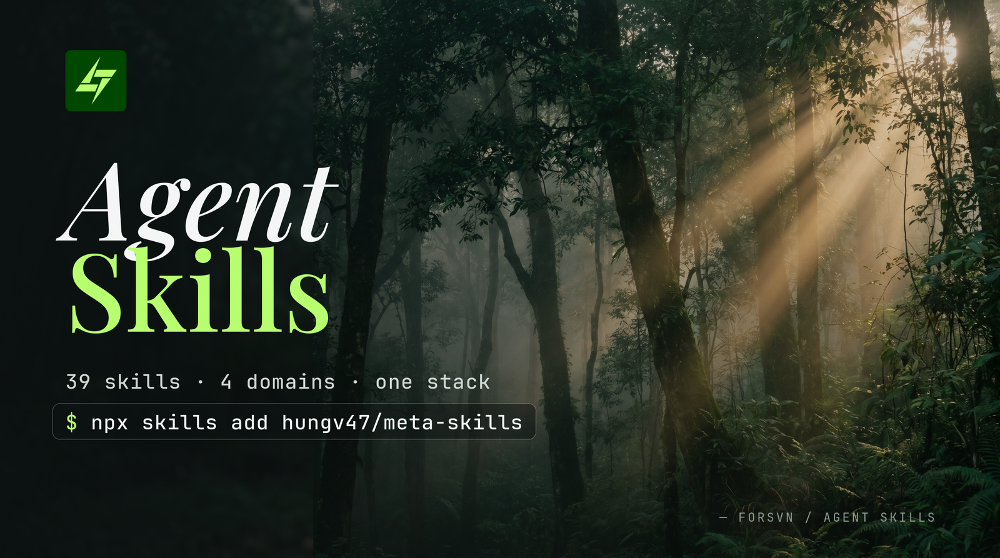

# Agent Skills



**40 skills that turn an AI agent into a product team — from "why did this break?" to shipped code.**

A composable skill stack for [AI agents](https://agentskills.io/home), spanning four domains:

- **Research** — understand the market and decide what to do
- **Marketing** — create, optimize, and measure marketing
- **Product** — design and build software
- **Meta** — discover, debate, decompose, and verify any of it

Skills chain. Each one reads what earlier skills left behind — in conversation or in `.forsvn/` artifacts — so output compounds as you move through the stack. Not sure where to start? Run `/forsvn`, the single front door.


**Install — one plugin, all 40 skills:** `/plugin marketplace add hungv47/meta-skills` (Claude Code) · `npx skills add hungv47/meta-skills` (Cursor, Codex, others).

> **Plugin name:** the Claude plugin is `forsvn-skills`; the repository URL remains `github.com/hungv47/meta-skills` so existing links keep working.
>
> **New in 2.0** — the four former plugins (`research-skills`, `marketing-skills`, `product-skills`, `meta-skills`) are now one `forsvn-skills` install. Verb-first skill names, `/forsvn` as the single front door, `.forsvn/` as the canonical state root. Upgrading from a 4-plugin install? See [Migrating from pre-2.0](#migrating-from-pre-20-4-plugin-install).

## Install

Single plugin, all 40 skills. Works with Claude Code's plugin system, or the editor-agnostic [`skills` CLI](https://skills.sh) (Cursor, Codex, Windsurf, Gemini CLI, VS Code).

### Via Claude Code plugin marketplace

```
/plugin marketplace add hungv47/meta-skills
/plugin install forsvn-skills
```

### Via `skills` CLI (recommended for non-Claude editors)

```bash
npx skills add hungv47/meta-skills
```

Requires Node.js 18+.

### Install a single skill

Cherry-pick any of the 40 skills with `--skill`:

```bash
npx skills add hungv47/meta-skills --skill write-copy
npx skills add hungv47/meta-skills --skill research-icp
npx skills add hungv47/meta-skills --skill architect-system
npx skills add hungv47/meta-skills --skill review-work
```

Single-skill installs are self-contained — shared scripts and references the skill needs are packaged with it, so `--skill <name>` doesn't depend on sibling skills being installed.

Cherry-pick multiple skills in a single call:

```bash
npx skills add hungv47/meta-skills --skill write-copy humanmaxxing review-work
```

List what's available without installing:

```bash
npx skills add hungv47/meta-skills --list
```

### Target a specific editor

```bash
npx skills add hungv47/meta-skills --agent claude-code
npx skills add hungv47/meta-skills --agent claude-code cursor
```

### Install globally

Make all 40 skills available in every project on your machine:

```bash
npx skills add hungv47/meta-skills -g
```

### Other operations

```bash
npx skills list                          # list installed skills
npx skills update                        # update to latest versions
npx skills remove                        # interactive remove by skill name
npx skills find write-copy               # search the skills registry
```

Run `npx skills --help` for the full command reference.

### Migrating from pre-2.0 (4-plugin) install

If you previously installed any of `research-skills`, `marketing-skills`, `product-skills`, or the standalone `meta-skills` plugin, remove them and reinstall the consolidated plugin — every skill is preserved:

```bash
npx skills remove research-skills marketing-skills product-skills meta-skills
npx skills add hungv47/meta-skills
```

Or for Claude Code plugin marketplace users:

```
/plugin marketplace remove agent-skills
/plugin marketplace add hungv47/meta-skills
/plugin install forsvn-skills
```

The 4 source repos (`research-skills`, `marketing-skills`, `product-skills`, `agent-skills` umbrella) are archived on GitHub.

## Getting Started

### Fastest path

```bash
npx skills add hungv47/meta-skills -g    # install all 40 skills globally
```

If you're not sure where to start, run `/forsvn` — the single front door. It reads cross-stack project state in `.forsvn/`, classifies your intent, asks ≤2 clarifying questions if needed, and routes you to the right leaf skill (or resumes a prior initiative).

### /forsvn — the front door

`/forsvn` is the only branded skill in the stack (every other skill is verb-first). It reads what's already in `.forsvn/`, `research/`, `brand/`, and `architecture/`, parses your free-form ask, and proposes the next concrete action. Use it when:

- You don't know which skill to call.
- You want to continue something you started.
- A vague ask needs to land somewhere concrete.

Direct skill calls still work — `/forsvn` is the discovery surface, not a gate. Re-running `/forsvn` finds prior state in `.forsvn/routing/last-session.md` and offers resume.

### How invocation works

Every installed skill becomes a slash command in your editor:

```
/research-icp "B2B project management SaaS for agencies"
/architect-system "team dashboard with real-time status"
/discover "vague idea I want to flesh out"
/review-work
```

You don't have to remember names. Type a plain-English request and your agent reads the available skills and proposes the right one. Saying *"help me figure out who we're building for"* surfaces `/research-icp`. Saying *"this codebase has accumulated cruft"* surfaces `/clean-code`. Or just type `/forsvn` and let it route.

### Pre-Dispatch: skills ask once, remember forever

Most skills bundle 3–7 context questions in a single message before dispatching their sub-agents. Answer all the questions in one reply — the skill is gathering enough context to run multiple agents in parallel.

Answers persist to `.forsvn/experience/{domain}.md` (product, audience, brand, business, goals, technical). The next skill in the same project reads from this file and skips re-asking. First skill in a project costs 1–2 minutes of setup; everything downstream skips straight to work.

### Where outputs land

`.forsvn/` is the canonical state root. Three folders remain top-level because they're canonical records the team owns long-term:

- `research/` — audience and market records (`product-context.md`, `icp-research.md`, `market-research.md`)
- `brand/` — brand identity of record (`BRAND.md`, `DESIGN.md`, `ASSETS.md`)
- `architecture/` — system blueprint of record (`system-architecture.md`, schemas, ADRs)

Everything else lives under `.forsvn/`:

- `.forsvn/context/` — 12-section shared product-marketing context
- `.forsvn/experience/` — append-only cross-skill Q&A substrate
- `.forsvn/artifacts/{domain}/` — one-shot skill outputs (briefs, specs, audits, reports)
- `.forsvn/loops/[slug]/` — strategy, execution, evals, `results.tsv`, `learnings.md` for measurable initiatives
- `.forsvn/evals/` — standalone evals + critic-override log
- `.forsvn/routing/` — `/forsvn` resume metadata + intent history
- `.forsvn/dashboard/` — derived quality views

## Full Pipeline

End-to-end pipeline: meta process wrappers compose with research pipeline skills, product skills (pipeline + horizontal), and marketing skills (pipeline + horizontal).

**40 skills total**: 8 research + 19 marketing + 6 product + 7 meta. `/forsvn` (the front door) reads project state and routes to the right leaf skill. Research and product pipelines run in sequence; marketing has a pipeline plus horizontal skills (`write-copy`, `humanmaxxing`, `polish-vn`) that apply at any stage. Meta skills are domain-agnostic process wrappers that compose with any skill. Measurable initiatives can be wrapped in `/run-eval-loop`, the single scaffold/ledger entrypoint for autoresearch-style keep/discard cycles. Surface-specific eval skills still do the scoring. Short-form video pipeline: `research-shortform` → `brief-shortform` + `write-social` → `evaluate-shortform` (closes the loop). Landing-page loop: `run-eval-loop` → `evaluate-landing-page` for post-launch scoring.

## Skill Stacks

### Research — understand your market and decide what to do

> 8 skills in [`skills/research/`](./skills/research/)

```
research-icp → research-market + diagnose → prioritize → plan-funnel
research-shortform → .forsvn/artifacts/research/research-shortform/[slug].md (consumed by brief-shortform)
research-platform  → .forsvn/artifacts/research/platform-evidence/[slug].md (owned-analytics evidence base; consumed by write-social, optimize-seo, research-shortform)
```

| Skill | What it does | Use when... |
|-------|-------------|-------------|
| `research-icp` | Builds ideal customer profiles — demographics, pain points, jobs-to-be-done, segmentation | You're entering a new market, launching a product, or need to understand who you're building for |
| `research-market` | Maps competitive landscape, TAM/SAM/SOM sizing, whitespace opportunities | You need to size an opportunity, understand competitors, or find market gaps |
| `diagnose` | Structured diagnosis — logic trees, hypotheses, root cause analysis | A metric dropped, something broke, or you need to figure out *why* before jumping to solutions |
| `prioritize` | Generates strategic options, scores trade-offs with ICE, recommends a path | The problem is clear and you need to decide *what* to build or pursue |
| `plan-funnel` | Backward funnel modeling — revenue goals to traffic, conversions, unit economics | You need numeric targets: "how much traffic do we need to hit $X ARR?" |
| `research-shortform` | Per-platform best-practice catalog — pulls hook archetypes, format constraints, algorithm signals, anti-patterns (consumed by `brief-shortform`) | You're starting a video pipeline and need fresh research grounding hooks/formats/signals across tiktok/reels/shorts/x/linkedin |
| `research-platform` | Per-platform evidence base from the operator's *own* platform data — owned analytics, public metrics, manual exports, prior eval outcomes — every metric source-tagged and freshness-dated, every recommendation attributed (consumed by `write-social`, `optimize-seo`, `research-shortform`, `evaluate-*`) | You want social / SEO / short-form decisions grounded in your accounts' measured performance, not intuition |
| `evaluate-shortform` | Closes the feedback loop — scores published short-form posts against the original brief, logs patterns, flags platform-signal staleness | You've published a video and want to know what the brief got right vs. what surprised you |

### Marketing — create, optimize, and measure marketing

> 19 skills in [`skills/marketing/`](./skills/marketing/)

```
create-brand
  ↓
plan-campaign
  ↓
  ├─ brief-landing-page (per page; owns conversion best practices) → brief-graphic (per asset slot)
  ├─ run-eval-loop → evaluate-landing-page (post-launch page evidence)
  ├─ optimize-seo (per mode)
  ├─ write-ad (per audience temperature)
  └─ write-outreach (per touch)

Horizontal: write-copy, humanmaxxing, polish-vn — invoked at any stage.
```

| Skill | What it does | Use when... |
|-------|-------------|-------------|
| `create-brand` | Brand identity — color palettes, typography, design tokens, voice, visual language | You need a visual identity system before creating any marketing materials |
| `plan-campaign` | Channel strategy, positioning, content calendar, budget allocation, GTM timelines | You're planning a campaign or go-to-market and need to decide where, when, and how much |
| `write-copy` | Headlines, hooks, CTAs, taglines, full-page section copy with scoring | You need persuasive copy for any surface — landing pages, ads, emails, product UI |
| `brief-landing-page` | Campaign-grade landing-page brief — hypothesis, architecture, per-section spec, conversion gate, asset slots, hand-off prompts | You're creating or revising a landing page and need a brief precise enough for a designer or AI tool to execute |
| `evaluate-landing-page` | Post-launch landing-page evaluation — metric ingest, diagnosis, keep/discard/watch/blocked row, learning promotion | A launched landing page has analytics, experiment results, or metric notes and needs a loop-local decision |
| `brief-graphic` | Per-asset graphic-design brief with platform-aware specs (aspect, safe zones, type scale, contrast, file format) and downstream handoff (image-gen prompt / vector-tool spec / designer-handoff) | You need a brief for a single visual asset (IG carousel, OG image, banner ad, YT thumbnail, OOH, etc.) — rendering happens downstream |
| `optimize-seo` | Technical audit, AI/AEO optimization, programmatic SEO, ASO | You want more organic traffic — search, AI answers, or app store visibility |
| `humanmaxxing` | Strips AI patterns, injects brand voice, compresses for density | You have AI-generated text that sounds robotic and needs to read human |
| `polish-vn` | Polishes translated Vietnamese into a native register (báo chí, semi-casual, bro, or pop-marketing) | You have Vietnamese copy that reads translated/robotic or needs register alignment |
| `write-ad` | Meta paid-ad copy for retargeting or cold traffic — hero + 2 variants with char-cap, policy, claim, voice, and critic gates | You're shipping Facebook/Instagram ads and need audience-temperature-specific creative copy |
| `write-outreach` | Cold email / DM / proposal composition with signal-based personalization, channel-specific craft, rubric scoring, terminal humanmaxxing pass | You're writing first-touch outbound or replies to inbound responses and want it to read like a sharp human, not a template |
| `brief-shortform` | Per-asset short-form video brief — hook, shot list, on-screen text, audio plan, caption, CTA, aspect, length. Hard cap: 1 hero + 2 platform variants per invocation. Brand modes: founder / company. Polish chain auto-routes per (market, brand_mode) | You're producing a TikTok / Reels / Shorts / X / LinkedIn video and need a production-ready brief tied to platform-intelligence + ICP voice |
| `write-social` | Platform-native social copy — A/B hook variants, body, CTA. Char-limit + CTA-truncation enforced; 5-dim critic rubric (hook strength / char-word limit / CTA placement / pattern-interrupt density / format compliance) | You need ready-to-publish copy for tiktok / reels / shorts / x / linkedin from a brief or topic |

### Product — design and build software

> 6 skills in [`skills/product/`](./skills/product/)

| Skill | What it does | Use when... |
|-------|-------------|-------------|
| `map-user-flow` | Maps screens, decisions, transitions, edge cases, and error states | You're designing a feature and need to think through every screen and path |
| `architect-system` | Technical blueprints — tech stack, database schema, API design, file structure, deployment, security review (STRIDE + OWASP + LLM security), dependency classification | You know what to build and need to decide *how* — the technical design |
| `clean-code` | Structural audit, AI slop removal (code-level + frontend/visual), dead code, unused assets, refactoring | Your codebase has accumulated cruft and needs a quality pass |
| `clean-machine` | Audits and cleans your dev machine — dotfolders, caches, language toolchains, package-manager globals — with risk surfacing (auth, processes, shell-rc) and per-target confirmation | Your machine has accumulated years of toolchains, caches, and SDKs and you want to reclaim disk safely |
| `write-docs` | READMEs, API references, setup guides, runbooks from existing code. Ship log mode writes product context to `research/product-context.md`. Sync mode for post-change doc updates | You have a codebase and need documentation generated or updated after changes |

### Meta — discover, debate, decompose, verify

> 7 skills in [`skills/meta/`](./skills/meta/), with `/forsvn` as the branded front door

| Skill | What it does | Use when... |
|-------|-------------|-------------|
| `forsvn` | Front door — classifies intent, loads `.forsvn/` state, asks ≤2 clarifying questions if needed, routes to a leaf skill or resumes a prior initiative | You don't know which skill to call, want to continue something, or want a vague ask to land somewhere concrete |
| `discover` | Conversational discovery — adapts from quick scoping (3-5 questions) to deep interviews | You have a vague idea or clear task and want alignment before building |
| `debate-agents` | Multi-agent discussion rooms — debate (argue in rounds) or consensus polling | You're facing a complex decision and want multiple perspectives |
| `run-eval-loop` | Creates or resumes a measurable improvement workspace with `program.md`, `context.md`, `strategy/`, `execution/`, `evals/`, `results.tsv`, and `learnings.md` under `.forsvn/loops/[slug]/` | You want a campaign, page, ad set, email sequence, social series, or content motion to improve over measured cycles |
| `breakdown-tasks` | Decomposes work into granular, testable tasks with acceptance criteria | Work is too big to just start — needs decomposition first |
| `review-work` | Fresh-eyes review — implement, review, resolve. Max 2 rounds | You've built something and want an independent quality check |
| `clean-artifacts` | Audits + grooms `.forsvn/artifacts/` — classifies KEEP/STALE/ORPHAN/LEGACY/EPHEMERAL, archives behind explicit per-category confirmation. Never deletes | `.forsvn/artifacts/` has gone junk-drawer or you're prepping for a release |

Meta-skills are domain-agnostic process wrappers. They compose with any skill in any stack.

## When to Use What

Not sure which skill to run? Find your situation:

| Situation | Run this |
|-----------|----------|
| "Who are we building for?" | `/research-icp` |
| "How big is this market?" | `/research-market` |
| "Why did this metric drop?" | `/diagnose` |
| "What should we build?" | `/prioritize` |
| "How much traffic do we need?" | `/plan-funnel` |
| "We need a brand identity" | `/create-brand` |
| "Plan the launch campaign" | `/plan-campaign` |
| "Write better headlines / CTAs / taglines" | `/write-copy` |
| "Our landing page isn't converting and we have analytics" | `/evaluate-landing-page` |
| "Brief a landing page or redesign" | `/brief-landing-page` |
| "Brief a single graphic-design asset (carousel / OG / thumbnail / banner)" | `/brief-graphic` |
| "We need more organic traffic" | `/optimize-seo` |
| "Write Meta ad copy for retargeting or cold traffic" | `/write-ad` |
| "Write a cold email / DM / proposal" | `/write-outreach` |
| "This reads like AI wrote it" | `/humanmaxxing` |
| "Polish Vietnamese that sounds translated" | `/polish-vn` |
| "Create an autoresearch-style loop for this campaign/page/content series" | `/run-eval-loop` |
| "Where should strategy, execution, evals, and learnings live for this measurable initiative?" | `/run-eval-loop` |
| "Map the screens for this feature" | `/map-user-flow` |
| "Design the technical system" | `/architect-system` |
| "This codebase needs cleanup" | `/clean-code` |
| "Generate docs from the code" | `/write-docs` |
| "Write a product snapshot for agents" | `/write-docs --ship-log` |
| "Update docs after this change" | `/write-docs --sync` |
| "Scope this before building" | `/discover` |
| "Help me think through this idea" | `/discover` |
| "Break this into tasks" | `/breakdown-tasks` |
| "Debate this decision" | `/debate-agents` |
| "Verify this output" | `/review-work` |

## Worked Examples: Artifact Flow in Practice

Real workflows are 3-6 skills, not 16. Each example below is a chain users actually run end-to-end in one session.

### Example 1: Research → Marketing Pipeline

```
/research-icp "B2B project management SaaS for agencies"
  └─ writes research/product-context.md (personas, pain points, JTBD)
  └─ writes research/icp-research.md (full audience analysis)

/plan-campaign "Q3 launch campaign"
  ├─ reads research/product-context.md (audience)
  ├─ reads research/icp-research.md (personas)
  └─ writes .forsvn/artifacts/mkt/plan-campaign/q3-launch.md (channels, calendar, budget)

/brief-landing-page "Q3 launch landing page"
  ├─ reads research/product-context.md (voice, audience language)
  ├─ reads brand/BRAND.md + brand/DESIGN.md (visual language, lexicon)
  ├─ reads .forsvn/artifacts/mkt/plan-campaign/q3-launch.md (campaign hypothesis, conversion targets)
  └─ writes .forsvn/artifacts/mkt/brief-landing-page/q3-launch/brief.md + asset-slots/*.prompt.md

/brief-graphic "hero image for q3-launch (slot: hero-image)"
  ├─ reads brand/DESIGN.md (palette, typography, sacred elements)
  ├─ reads .forsvn/artifacts/mkt/brief-landing-page/q3-launch/asset-slots/hero-image.md (slot spec)
  └─ writes .forsvn/artifacts/mkt/brief-graphic/q3-launch-hero.md (concept + platform spec + image-gen prompt)
```

Each downstream skill produces richer output because it inherits upstream context. The `brief-graphic` output references audience pain points from `research-icp`, messaging pillars from `plan-campaign`, and the conversion hypothesis from `brief-landing-page` — without the user repeating any of it.

### Example 2: Product Pipeline

```
/discover "build a team dashboard with real-time project status"
  └─ conversation produces key decisions (scope, tech choices, edge cases)
  └─ optionally writes .forsvn/artifacts/meta/specs/<slug>.md (if user asks to save; includes FAILURE conditions)

/map-user-flow "team dashboard"
  ├─ reads .forsvn/artifacts/meta/specs/<slug>.md (if saved) or conversation context
  └─ writes .forsvn/artifacts/product/flow/team-dashboard.md (screens, transitions, platform-surface matrix, edge states)

/architect-system "team dashboard"
  ├─ reads .forsvn/artifacts/meta/specs/<slug>.md (requirements)
  ├─ reads .forsvn/artifacts/product/flow/*.md (every flow file; screens and surface matrix inform API design)
  └─ writes architecture/system-architecture.md (stack, schema, API, deployment)

/breakdown-tasks
  ├─ reads architecture/system-architecture.md (what to build)
  ├─ reads .forsvn/artifacts/product/flow/*.md (UX requirements per task across every flow)
  └─ writes .forsvn/artifacts/meta/tasks.md (ordered tasks with acceptance criteria)

(build tasks) → /review-work
```

### Example 3: Multi-Perspective Decision

```
/debate-agents "debate: should we build a Chrome extension or a web app?"
  ├─ spawns 3 agents (Architect, Pragmatist, Critic)
  ├─ 3 rounds of structured debate
  └─ writes .forsvn/artifacts/meta/decisions/[date]-<slug>.md (consensus, splits, recommendation)
```

### Example 4: Diagnose a Declining Metric

```
/diagnose "checkout conversion dropped 30% over the last 6 weeks"
  ├─ reads research/product-context.md (audience baseline)
  ├─ Layer 1 parallel: tree-builder + external-check
  ├─ Layer 2 sequential: hypothesis → data-mapper → verdict → critic
  └─ writes .forsvn/artifacts/meta/records/diagnose-*.md (root cause + evidence + ranked hypotheses)

/prioritize "checkout fixes from diagnose output"
  ├─ reads .forsvn/artifacts/meta/records/diagnose-*.md (which causes to address)
  ├─ reads research/product-context.md (audience constraints)
  └─ writes .forsvn/artifacts/meta/sketches/prioritize-*.md (ICE-scored fix list with cut line)

/plan-funnel "set checkout recovery targets"
  ├─ reads .forsvn/artifacts/meta/sketches/prioritize-*.md (initiatives → metrics)
  └─ writes .forsvn/artifacts/meta/records/targets-*.md (numeric targets for traffic, CR, revenue)
```

### Example 5: Brief and Revise a Landing Page

```
/brief-landing-page "/pricing redesign"
  ├─ reads brand/BRAND.md + brand/DESIGN.md (visual + voice)
  ├─ reads research/product-context.md + research/icp-research.md (audience pain language)
  ├─ uses page state / analytics notes if provided
  └─ writes .forsvn/artifacts/mkt/brief-landing-page/pricing/brief.md + asset-slots/*.prompt.md

/brief-graphic "hero illustration for pricing (slot: hero-image)"
  ├─ reads brand/DESIGN.md + .forsvn/artifacts/mkt/brief-landing-page/pricing/asset-slots/hero-image.md
  └─ writes .forsvn/artifacts/mkt/brief-graphic/pricing-hero.md (concept + image-gen prompt)

/write-copy "rate the hero copy candidates from the brief"
  ├─ reads .forsvn/artifacts/mkt/brief-landing-page/pricing/brief.md (copy candidates inline)
  └─ writes .forsvn/artifacts/mkt/write-copy/pricing-hero.md (alternatives + rationale)
```

### Example 6: Write a Cold Outbound Sequence

```
/research-icp "founders of seed-stage B2B AI startups"
  └─ writes research/product-context.md + research/icp-research.md (audience, signals, voice)

/write-outreach "first-touch email to founders of seed AI startups, channel: email"
  ├─ reads research/product-context.md + research/icp-research.md (audience signals)
  ├─ Layer 1: signal-analyst → strategist + proof-selector in parallel
  ├─ Layer 2: composer → voice-auditor → critic → terminal humanmaxxing
  └─ writes .forsvn/artifacts/mkt/write-outreach/founder-touch1.md + .rationale.md + .critic-score.md

/write-outreach "reply to: <prospect's response asking about pricing>"
  ├─ reads .forsvn/artifacts/mkt/write-outreach/founder-touch1.md (prior touch context)
  └─ writes .forsvn/artifacts/mkt/write-outreach/founder-reply1.md (reply + rationale + score)
```

## Tips for Effective Use

**Start with `/forsvn` when you don't know where to start.** The front door reads your `.forsvn/` state and routes — vague asks land somewhere concrete in under a minute.

**Use `/discover` for vague work that needs a spec.** "Build something cool" gets nowhere. `/discover` interviews you in 3–8 questions and produces a concrete spec other skills can run on.

**Run `/research-icp` before any marketing work.** It writes `research/product-context.md` — the foundation artifact 13+ downstream skills consume. Skip it and every downstream skill re-asks you for audience details.

**Chain skills, don't one-shot.** A 5-skill chain (`research-icp` → `diagnose` → `prioritize` → `plan-campaign` → `write-copy`) produces sharper output than running `write-copy` alone, because each downstream skill inherits real upstream context. The Worked Examples above show real chains.

**Run `/review-work` before shipping.** Security-sensitive code and data-mutation work auto-trigger it. Run it manually on marketing copy, briefs, and architecture docs — it catches what you can't see after staring at a draft.

**Let artifacts compound.** `.forsvn/` and the canonical folders (`research/`, `brand/`, `architecture/`) accumulate across sessions. After a month you have prioritize history, target docs, every copy variant, every design brief — all version-stamped, all referenceable. Don't delete them.

**Edit artifact frontmatter when reality changes.** If `research/product-context.md` says you serve agencies but you've pivoted to enterprise, edit the file directly. Skills read whatever's there now — they don't lock to the original session.

**Answer Pre-Dispatch questions in one reply.** When a skill asks 5 questions in one message, answer all 5 in one response. The skill is bundling so it can dispatch parallel sub-agents — answering one at a time forces it to re-prompt and slows everything down.

**Use horizontal skills late, not early.** `humanmaxxing`, `polish-vn`, `write-copy` apply to outputs from any pipeline skill. Run them as a polish pass after the pipeline produces a draft, not as a starting point.

**Override skill recommendations when you have context.** Skills auto-detect the right path (e.g., `brief-graphic` auto-routes to image-gen vs. vector-tool). If you know better, override with flags or correct in the conversation.

**Install globally.** The meta-layer skills (`/forsvn`, `/discover`, `/run-eval-loop`, `/debate-agents`, `/breakdown-tasks`, `/review-work`) are domain-agnostic and useful in every project on your machine — `npx skills add hungv47/meta-skills -g` is the install most people regret skipping.

## How Skills Communicate

Skills pass data through markdown files under `.forsvn/`, canonical folders, and measurable loop folders:

| Artifact | Produced by | Consumed by |
|----------|------------|-------------|
| `product-context.md` | `research-icp`, `write-docs --ship-log` | 13+ skills across all stacks |
| `market-research.md` | `research-market` | `prioritize` |
| `.forsvn/artifacts/meta/records/diagnose-*.md` | `diagnose` | `prioritize` |
| `.forsvn/artifacts/meta/sketches/prioritize-*.md` | `prioritize` | `plan-campaign`, `architect-system`, `plan-funnel` |
| `.forsvn/artifacts/meta/records/targets-*.md` | `plan-funnel` | — (terminal until measurement skill exists) |
| `brand/BRAND.md`, `brand/DESIGN.md`, `brand/ASSETS.md` | `create-brand` | Visual decisions in `brief-landing-page`, `brief-graphic`, `humanmaxxing`, `write-copy` |
| `.forsvn/artifacts/mkt/plan-campaign/[slug].md` | `plan-campaign` | `brief-landing-page`, `optimize-seo`, `write-outreach`, `write-copy` |
| `.forsvn/artifacts/mkt/write-copy/[slug].md` | `write-copy` | `humanmaxxing`, `polish-vn`, `brief-graphic` (copy-anchor) |
| `.forsvn/artifacts/mkt/humanmaxxing/[slug].md` | `humanmaxxing` | `polish-vn` |
| `.forsvn/artifacts/mkt/polish-vn/[slug].md` | `polish-vn` | — (terminal) |
| `.forsvn/artifacts/mkt/optimize-seo/[mode].md` | `optimize-seo` | `write-copy`, `brief-landing-page` |
| `.forsvn/artifacts/mkt/brief-landing-page/[slug]/brief.md` + `asset-slots/*.prompt.md` | `brief-landing-page` | `brief-graphic` (per slot) + external designer / image-gen |
| `.forsvn/loops/[slug]/evals/[date]-cycle-N.md` | `evaluate-landing-page` | `results.tsv`, `learnings.md`, next-cycle `brief-landing-page` |
| `.forsvn/artifacts/mkt/brief-graphic/[slug].md` | `brief-graphic` | External image-gen / vector-tool / human designer |
| `.forsvn/artifacts/mkt/write-outreach/[slug].md` | `write-outreach` | — (terminal) |
| `.forsvn/artifacts/product/flow/<flow-name>.md` + `index.md` | `map-user-flow` | `architect-system`, `breakdown-tasks` |
| `.forsvn/artifacts/meta/specs/<slug>.md` | `discover` (optional) | `architect-system`, `breakdown-tasks` |
| `.forsvn/loops/[slug]/program.md` + `context.md` | `run-eval-loop` | Strategy, execution, and evaluation skills for that measurable initiative |
| `.forsvn/loops/[slug]/strategy/*.md` | Strategy skills (`plan-campaign`, `brief-landing-page`, etc.) | Execution and evaluation skills in the same loop |
| `.forsvn/loops/[slug]/execution/*.md` | Execution skills | Evaluation skills and future strategy cycles |
| `.forsvn/loops/[slug]/evals/*.md` + `results.tsv` | Evaluation skills | Future strategy/execution cycles; `learnings.md` promotion |
| `architecture/system-architecture.md` | `architect-system` | `breakdown-tasks` |
| `.forsvn/artifacts/meta/tasks.md` | `breakdown-tasks` | Task execution |
| `.forsvn/artifacts/meta/records/cleanup-*.md` | `clean-code` | — (terminal) |
| `.forsvn/artifacts/meta/decisions/[date]-<slug>.md` | `debate-agents` | — (lifecycle: decision — dated, immutable) |
| `.forsvn/artifacts/meta/records/[date]-review-work-<slug>.md` | `review-work` | — (lifecycle: snapshot — dated, immutable) |
| `.forsvn/routing/last-session.md` + `routing/history/*.md` | `forsvn` | Future `/forsvn` invocations (resume) |

Every markdown artifact includes frontmatter with `skill`, `version`, `date`, and `status` fields for traceability. `scripts/manifest-sync.ts` indexes `.forsvn/`, `research/`, `brand/`, and `architecture/`.

## Architecture

Most skills use a **two-layer multi-agent orchestration** pattern:

```
SKILL.md (Orchestrator)
  ├─ Layer 1: Parallel specialists ──── run concurrently
  ├─ Merge Step ──────────────────────── assemble outputs
  ├─ Layer 2: Sequential refiners ───── run in order
  └─ Critic Agent ────────────────────── PASS / FAIL (max 2 cycles)
```

**~150 specialized agents** across domain skills. Meta-skills use additional patterns: **dynamic agent spawning** (`debate-agents`, `review-work`) and **conversation-first discovery** (`discover`, `forsvn`).

## Releases

Update an existing install:

```bash
npx skills update                                  # via skills CLI
# or
/plugin marketplace update forsvn-skills && /plugin update forsvn-skills    # via Claude Code
```

Fresh install (full stack):

```bash
npx skills add hungv47/meta-skills
# or
/plugin marketplace add hungv47/meta-skills && /plugin install forsvn-skills
```

Cherry-pick a single skill:

```bash
npx skills add hungv47/meta-skills --skill write-copy
```

Release notes: [`CHANGELOG.md`](./CHANGELOG.md). All 40 skills release in lockstep under one version number, with `[meta]` / `[research]` / `[marketing]` / `[product]` prefixes on stack-scoped entries.

Pre-2.0 history lives in the archived repos: [research-skills](https://github.com/hungv47/research-skills/blob/main/CHANGELOG.md), [marketing-skills](https://github.com/hungv47/marketing-skills/blob/main/CHANGELOG.md), [product-skills](https://github.com/hungv47/product-skills/blob/main/CHANGELOG.md), [meta-skills v1.x](https://github.com/hungv47/meta-skills/commits/main).

## Changelog

- [CHANGELOG.md](./CHANGELOG.md) — consolidated changelog from v2.0 onward
- [GitHub releases](https://github.com/hungv47/meta-skills/releases) — full release history

## License

MIT
